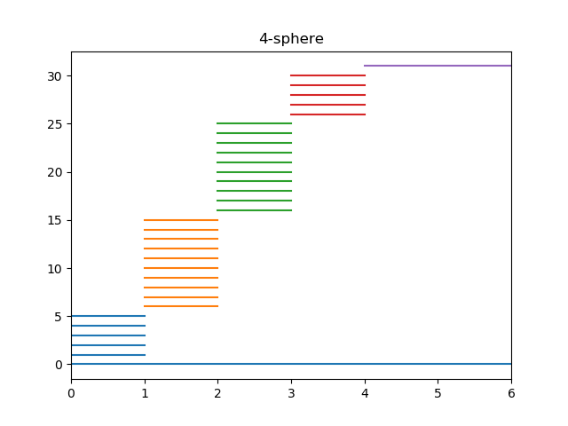

Compute persistent homology of a point cloud given a filtration file.

# Input


The required format for filtrations is
```bash
birth_time dimension first_vertex_index second_vertex_index ...
```
See `filtrations/` folder for examples. 

# Code 
Code in `td5.py` computes homology by building and reducing boundary matrix and outputs barcode images.

# Output
The code output barcodes like those in folder `barcodes/`.


